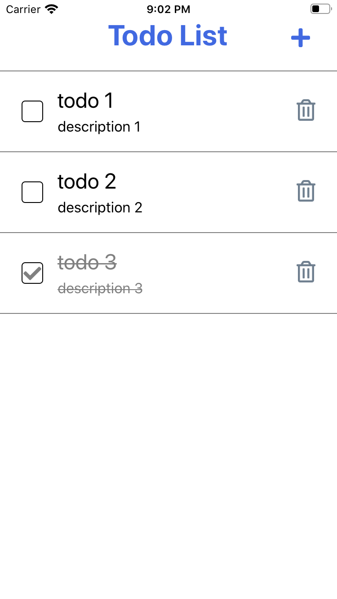
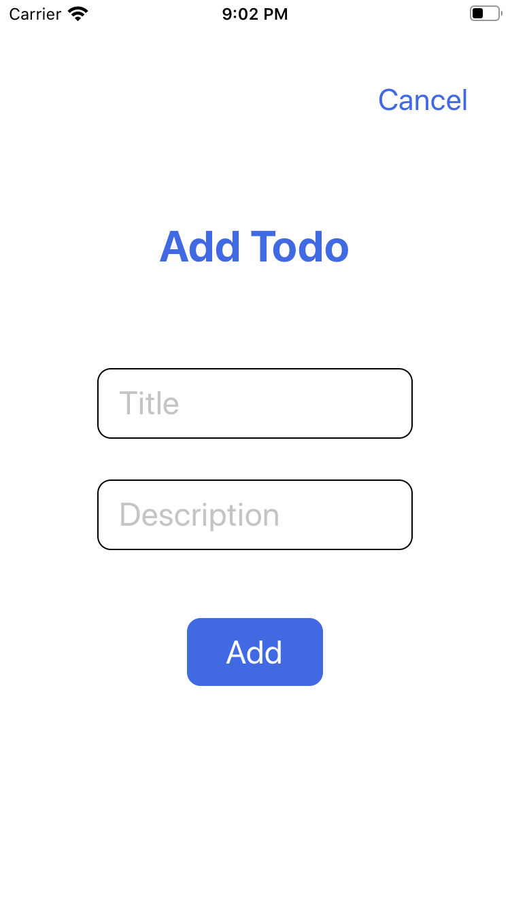
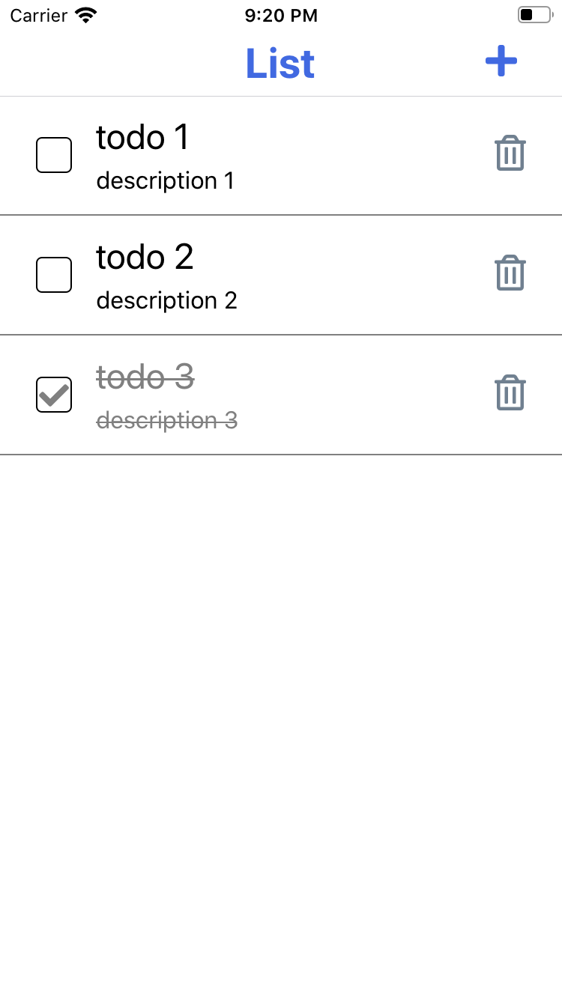
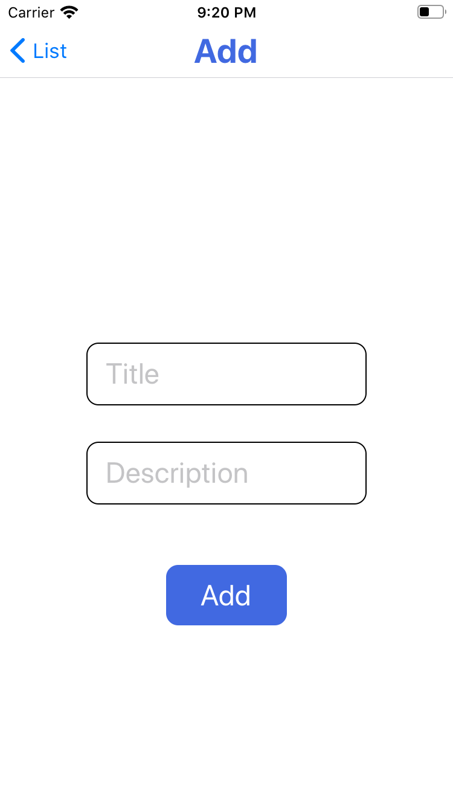

# はじめに

[こちら](https://github.com/alternacrow/TodoApp)の続編になります。

## react-navigation について

公式は[こちら](https://reactnavigation.org/)  
2020/02/06 に version ５がリリースされ、  
react-native-router-flux のような書き方に、大幅に変更された。  
[github](https://github.com/react-navigation/react-navigation)で example も公開されているので、  
各ナビゲーターの使用感はそちらで確認できる。

# Todo アプリに react-navigation を導入してみる

レポジトリはこちら
https://github.com/alternacrow/TodoAppWithNavigation

## 画面構成

### 導入前

|  |  |
| :--------------------------------------------------------------------: | :------------------------------------------------------------------: |


### 導入後

|  |  |
| :------------------------------------------------------------------: | :----------------------------------------------------------------: |


## 環境構築

- プロジェクトの初期化

```
git clone -b base git@github.com:alternacrow/TodoAppWithNavigation.git
cd TodoAppwithNavigation
yarn install
```

- 必要なライブラリのインストール

expo install を使用して追加します。  
expo install が必要ないものを対象にしても、通常通り npm や yarn で入れてくれます。  
今回使用するナビゲーションは、stack です。  
依存関係にあるライブラリ等は公式をご参照ください。

```
expo install @react-navigation/native react-native-gesture-handler react-native-reanimated react-native-screens react-native-safe-area-context @react-native-community/masked-view @react-navigation/stack
```

## コーディング

### 1. スタックナビゲーターの作成

- PropsType の export

<details><summary>src/containers/ListContainer.tsx</summary><div>

```diff
-type ListContainerProps = {
+export type ListContainerProps = {
   todos: Todo[];
   onPressPlus?: () => void;
   onPressCheck?: (todoId: number) => void;
 };
```

</div></details>

<details><summary>src/containers/AddContainer.tsx</summary><div>

```diff
-type AddContainerProps = {
+export type AddContainerProps = {
   onPressCancel?: () => void;
   onPressAdd?: (title: string, description: string) => void;
 };
```

</div></details>

- RootStackNavigator の作成

<details><summary>src/navigation/RootStack.tsx</summary><div>

```react
import React, { FC } from "react";
import { createStackNavigator } from "@react-navigation/stack";

import ListContainer, { ListContainerProps } from "../containers/ListContainer";
import AddContainer, { AddContainerProps } from "../containers/AddContainer";

export type RootStackParamList = {
  List: ListContainerProps;
  Add: AddContainerProps;
};

const Stack = createStackNavigator<RootStackParamList>();

type RootStackProps = ListContainerProps & AddContainerProps;

const RootStack: FC<RootStackProps> = ({
  todos = [],
  onPressCheck = () => undefined,
  onPressDelete = () => undefined,
  onPressAdd = () => undefined
}) => {
  const ListContainerParams: ListContainerProps = {
    todos,
    onPressCheck,
    onPressDelete
  };
  const AddContainerParams: AddContainerProps = {
    onPressAdd
  };

  return (
    <Stack.Navigator initialRouteName="List">
      <Stack.Screen
        name="List"
        component={ListContainer}
        initialParams={ListContaineParams}
      />
      <Stack.Screen
        name="Add"
        component={AddContainer}
        initialParams={AddContainerParams}
      />
    </Stack.Navigator>
  );
};

export default RootStack;
```

</div></details>

#### 解説

ListContainer と AddContainer をスタックナビゲーション上に載せるため、  
スタックナビゲータの作成を行っています。  
`RootStackParamList`では、作成するナビゲータのルート名と受け取るパラメータの型を定義しています。  
react-navigation では、ページ間でデータの受け渡しを行う機能として、params というものがあります。  
遷移時にタップしたアイテムのタイトルをヘッダに設定したい場合、などによく使用されます。

この段階では params に state の todos を渡していますが、後で修正することになります。

### 2. StackNavigator への置き換えと、ListContianer の修正

<details><summary>App.tsx</summary><div>

- 削除

```diff
-  const [mode, setMode] = useState<Mode>("list");
```

```diff
-  const changeMode = (mode: Mode) => {
-    setMode(mode);
-  };
```

```diff
-  const handlePressPlus = () => {
-    changeMode("add");
-  };
```

```diff
-  const handlePressCancel = () => {
-    changeMode("list");
-  };
```

```diff
-    changeMode("list");
```

- コンポーネントの置き換え

```react
return (
  <Fragment>
    <ListContainer
      todos={todos}
      onPressPlus={handlePressPlus}
      onPressCheck={handlePressCheck}
      onPressDelete={handlePressDelete}
    />
    <Modal visible={mode === "add"} animationType={"slide"}>
      <AddContainer
        onPressCancel={handlePressCancel}
        onPressAdd={handlePressAdd}
      />
    </Modal>
  </Fragment>
);
```

->

```react
return (
  <NavigationContainer>
    <RootStack
      todos={todos}
      onPressCheck={handlePressCheck}
      onPressDelete={handlePressDelete}
      onPressAdd={handlePressAdd}
    />
  </NavigationContainer>
);
```

</div></details>

<details><summary>src/containers/ListContainer.tsx</summary><div>

- import

```react
import { useNavigation, useRoute, RouteProp } from "@react-navigation/native";
import { StackNavigationProp } from "@react-navigation/stack";
import { RootStackParamList } from "../navigation/RootStack";
```

- type

```react
type NavigationProps = StackNavigationProp<RootStackParamList>;
type RouteProps = RouteProp<RootStackParamList, "List">;
```

```diff
 export type ListContainerProps = {
   todos: Todo[];
-  onPressPlus?: () => void;
   onPressCheck?: (todoId: number) => void;
   onPressDelete?: (todoId: number) => void;
 };
```

- props

```diff
-const ListContainer: FC<ListContainerProps> = ({
-  todos = [],
-  onPressPlus = () => undefined,
-  onPressCheck = () => undefined,
-  onPressDelete = () => undefined
-}) => {
+const ListContainer: FC<ListContainerProps> = (
+  {
+    // todos = [],
+    // onPressCheck = () => undefined,
+    // onPressDelete = () => undefined
+  }
+) => {
```

- navigation hooks

```react
const { navigate, setOptions } = useNavigation<NavigationProps>();
const {
  params: { todos, onPressCheck, onPressDelete }
} = useRoute<RouteProps>();
```

- plus button

```react
const handlePressPlus = () => {
  navigate("Add");
};

useEffect(() => {
  setOptions({
    headerRight: () => (
      <IconButton
        type="plus"
        onPress={handlePressPlus}
        style={styles.plus_button}
      />
    )
  });
}, []);
```

- コンポーネントの置き換え

```react
return (
  <SafeAreaView style={styles.safearea}>
    <View style={styles.container}>
      <View style={styles.header_container}>
        <Title>Todo List</Title>
        <IconButton
          type="plus"
          onPress={onPressPlus}
          style={styles.plus_button}
        />
      </View>
      <TodoList
        todos={todos}
        onPressCheck={onPressCheck}
        onPressDelete={onPressDelete}
      />
    </View>
  </SafeAreaView>
);
```

->

```react
return (
  <View style={styles.container}>
    <TodoList
      todos={todos}
      onPressCheck={onPressCheck}
      onPressDelete={onPressDelete}
    />
  </View>
)
```

- style

```react
const styles = StyleSheet.create({
  container: {
    flex: 1,
    backgroundColor: "white"
  },
  header_container: {
    alignItems: "center",
    paddingBottom: 20,
    borderBottomWidth: 1,
    borderColor: "gray"
  },
  todo: {
    borderBottomWidth: 1,
    borderColor: "gray"
  },
  plus_button: {
    marginRight: 30
  }
});
```

</div></details>

#### 解説

今回 List と Add の画面遷移をスタックナビゲータで行うため、mode ステートに関するものは削除しています。  
また、ナビゲータは`NavigationContainer`で囲ってあげる必要があります。

react-navigation では、react や redux のように hooks を提供しています。  
その中の２つが、`useNavigation`と`useRoute`になります。  
useNavigation では状態変更（遷移を行ったり、params を変更したり等）を、  
useRoute では現在の params やルート名を確認することが出来ます。

ListContainer では、useRoute を使用することで RootStack から渡された params を受け取っています。

setOptions では、ヘッダの右部分に、プラスボタンを設定しています。  
react-navigation の v4 から v5 への変更で、  
コンテナ内でナビゲーションのオプションを変更する命令を直感的に行えるようになりました。  
(v4 でも設定自体は可能だったが、扱いづらかった部分)

### 3. バグの修正

動作確認をすると分かるのですが、  
現時点では、todos の削除が正常に行えない状態にあります。  
RootStack コンポーネントで受け取った todos を console.log で確認すると分かるのですが、  
削除イベント実行後、state の todos 上からは対象の todo は削除されているが、  
params から受け取った todos には変更が無いことが分かります。

params では、受け取った時点での値を params に格納します。  
params の値を変更したい場合には、setParams を使用して直接 params を書き換える必要があります。  
上記のような仕様から、params は props と扱いが異なり、  
通常ナビゲーションによる遷移時に値を渡すような使い方が主になります。

今回の todos のような値をグローバルに扱いたい場合、  
redux 等のライブラリを使用することが望ましいですが、  
今回は container に対して props で渡すことを考えてみます。

<details><summary>src/navigatoin/RootStack.tsx</summary><div>

```diff
 export type RootStackParamList = {
-  List: ListContainerProps;
-  Add: AddContainerProps;
+  List: undefined;
+  Add: undefined;
 };
```

```diff
-  const ListContainerParams: ListContainerProps = {
-    todos,
-    onPressCheck,
-    onPressDelete
-  };
-  const AddContainerParams: AddContainerProps = {
-    onPressAdd
-  };
```

```react
return (
  <Stack.Navigator
    initialRouteName="List"
    headerMode="screen"
    screenOptions={{
      headerTitleStyle: styles.header_title
    }}
  >
    <Stack.Screen name="List">
      {() => (
        <ListContainer
          todos={todos}
          onPressCheck={onPressCheck}
          onPressDelete={onPressDelete}
        />
      )}
    </Stack.Screen>
    <Stack.Screen name="Add">
      {() => <AddContainer onPressAdd={onPressAdd} />}
    </Stack.Screen>
  </Stack.Navigator>
);
```

</div></details>

<details><summary>src/containers/ListContainer.tsx</summary><div>

```diff
-const ListContainer: FC<ListContainerProps> = (
-  {
-    // todos = [],
-    // onPressCheck = () => undefined,
-    // onPressDelete = () => undefined
-  }
-) => {
+const ListContainer: FC<ListContainerProps> = ({
+  todos = [],
+  onPressCheck = () => undefined,
+  onPressDelete = () => undefined
+}) => {
```

```diff
-  const {
-    params: { todos, onPressCheck, onPressDelete }
-  } = useRoute<RouteProps>();
```

</div></details>

#### 解説

ナビゲータ上でコンポーネントに対して props を渡す場合、記述したような渡し方になります。  
(公式 github の example で記述されている方法)  
下記では、warning や error が出るようになります。

```react
<Stack.Screen
  component={() => <Container props={props} />}
>
</Stack.Screen>
```

```react
<Stack.Screen>
  <Container props={props} />
</Stack.Screen>

```

### 4. AddContainer の修正

<details><summary>src/containers/AddContainer.tsx</summary><div>

- import

```diff
+import { useNavigation } from "@react-navigation/native";
+import { StackNavigationProp } from "@react-navigation/stack";
+import { RootStackParamList } from "../navigation/RootStack";
```

- type

```diff
+type NavigationProps = StackNavigationProp<RootStackParamList>;
```

- props

```diff
 export type AddContainerProps = {
-  onPressCancel?: () => void;
   onPressAdd?: (title: string, description: string) => void;
 };
```

```diff
 const AddContainer: FC<AddContainerProps> = ({
-  onPressCancel = () => undefined,
   onPressAdd = () => undefined
 }) => {
```

- function,handler

```diff
-  const resetInput = () => {
-    setTitle("");
-    setDescription("");
-  ｝;
+  const { goBack } = useNavigation<NavigationProps>();
+
+  const handlePressAdd = () => {
+    if (!title || !description) return;
+
+    onPressAdd(title, description);
+    goBack();
   };
```

- コンポーネントの置き換え

```react
return (
  <View style={styles.modal}>
    <TextButton onPress={onPressCancel} containerStyle={styles.cancel_button}>
      Cancel
    </TextButton>
    <Title>Add Todo</Title>
    <TextInputOutline
      placeholder="Title"
      value={title}
      onChangeText={text => setTitle(text)}
      style={styles.textinput}
      containerStyle={styles.todo_title}
    />
    <TextInputOutline
      placeholder="Description"
      value={description}
      onChangeText={text => setDescription(text)}
      style={styles.textinput}
      containerStyle={styles.todo_description}
    />
    <View style={styles.add_button}>
      <TextButton
        onPress={() => {
          if (!title || !description) return;

          onPressAdd(title, description);
          resetInput();
        }}
        style={styles.add}
      >
        Add
      </TextButton>
    </View>
  </View>
);
```

->

```react
return (
  <View style={styles.container}>
    <TextInputOutline
      placeholder="Title"
      value={title}
      onChangeText={text => setTitle(text)}
      style={styles.textinput}
      containerStyle={styles.todo_title}
    />
    <TextInputOutline
      placeholder="Description"
      value={description}
      onChangeText={text => setDescription(text)}
      style={styles.textinput}
      containerStyle={styles.todo_description}
    />
    <View style={styles.add_button}>
      <TextButton onPress={handlePressAdd} style={styles.add}>
        Add
      </TextButton>
    </View>
  </View>
);
```

- style

```react
const styles = StyleSheet.create({
  container: {
    flex: 1,
    alignItems: "center",
    justifyContent: "center",
    backgroundColor: "white"
  },
  todo_title: { marginTop: 70 },
  todo_description: { marginTop: 30 },
  textinput: {
    width: 200,
    height: 40,
    fontSize: 24
  },
  cancel_button: {
    position: "absolute",
    top: 60,
    right: 30
  },
  add_button: {
    width: 100,
    height: 50,
    alignItems: "center",
    justifyContent: "center",
    borderRadius: 10,
    backgroundColor: "royalblue",
    marginTop: 50
  },
  add: {
    fontSize: 24,
    color: "white"
  }
});
```

</div></details>

#### 解説

ScreenA と ScreenB がある場合、  
StackNavigator では、A->B の遷移では goBack 関数が使用できます。  
この時、ScreenA はアンマウントされず、A の上に B が被さるような状態になります。  
逆に、B から A へ戻る遷移を行うと、B はアンマウントされます。  
そのため、resetInput は不要となります。

以上
